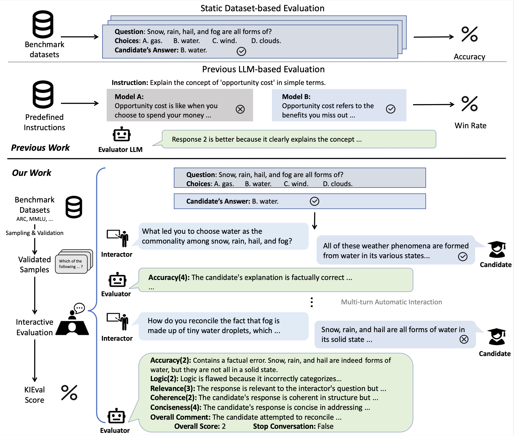

# KIEval: A Knowledge-grounded Interactive Evaluation Framework for Large Language Models

<div align="center">
  <a>Zhuohao Yu<sup>1</sup></a>&emsp;
  <a>Chang Gao<sup>1</sup></a>&emsp;
  <a>Wenjin Yao<sup>1</sup></a>&emsp;
  <a>Yidong Wang<sup>1</sup></a>&emsp; <br>
  <a>Wei Ye<sup>†1</sup></a>&emsp;
  <a>Jindong Wang<sup>2</sup></a>&emsp;
  <a>Xing Xie<sup>2</sup></a>&emsp;
  <a>Yue Zhang<sup>3</sup></a>&emsp;
  <a>Shikun Zhang<sup>†1</sup></a>&emsp;
  <p> <sup>1</sup> Peking University, <sup>2</sup> Microsoft Research, <sup>3</sup> Westlake University.</p>
</div>


## Overview
<div align="center">

<a href="https://github.com/zhuohaoyu/KIEval/">
    
</a>
</div>
Automatic evaluation methods for large language models (LLMs) are hindered by data contamination, leading to inflated assessments of their effectiveness. Existing strategies, which aim to detect contaminated texts, focus on quantifying contamination status instead of accurately gauging model performance. In this paper, we introduce KIEval, a Knowledge-grounded Interactive Evaluation framework, which incorporates an LLM-powered "interactor" role for the first time to accomplish a dynamic contamination-resilient evaluation. Starting with a question in a conventional LLM benchmark involving domain-specific knowledge, KIEval utilizes dynamically generated, multi-round, and knowledge-focused dialogues to determine whether a model's response is merely a recall of benchmark answers or demonstrates a deep comprehension to apply knowledge in more complex conversations. Extensive experiments on seven leading LLMs across five datasets validate KIEval's effectiveness and generalization. We also reveal that data contamination brings no contribution or even negative effect to models' real-world applicability and understanding, and existing contamination detection methods for LLMs can only identify contamination in pre-training but not during supervised fine-tuning.


## Quick Start

To get started, first clone the repository and setup the enviroment:

```bash
git clone <repo>
cd <repo>
pip install -r requirements.txt
```

To reproduce KIEval results, first start a text-generation-inference (huggingface.co/docs/text-generation-inference/en/index) instance with your candidate model:

```bash
model=meta-llama/Llama-2-7b-chat-hf
volume=$PWD/data # share a volume with the Docker container to avoid downloading weights every run

docker run --gpus all --shm-size 1g -p 8080:80 -v $volume:/data ghcr.io/huggingface/text-generation-inference:1.4 --model-id $model
```

 Then, generate an evaluation config with our script:

```bash
python scripts/generate-basic.py \
    --template ./config/template-basic.json \
    --dataset arc_challenge \
    --base_url http://your-tgi-url:port \
    --model_name llama-2-7b-chat-hf \
    --model_path meta-llama/Llama-2-7b-chat-hf \
    --openai_api_base https://api.openai.com/v1/ \
    --openai_key your_openai_key \
    --openai_model gpt-4-1106-preview \
    --output_path ./result \
    --generate_path ./config/generated.json
```

Finally, run the evaluation process:

```bash
python run.py -c ./config/generated.json
```


This repository provides all settings necessary for researchers to reproduce the results of KIEval, it also facilitates the reproduction of all metrics (from previous works) discussed in our paper. Please refer to `config/templates` for all supported evaluation methods.


## Citation

```
@misc{yu2024kieval,
      title={KIEval: A Knowledge-grounded Interactive Evaluation Framework for Large Language Models}, 
      author={Zhuohao Yu and Chang Gao and Wenjin Yao and Yidong Wang and Wei Ye and Jindong Wang and Xing Xie and Yue Zhang and Shikun Zhang},
      year={2024},
      eprint={2402.15043},
      archivePrefix={arXiv},
      primaryClass={cs.CL}
}
```