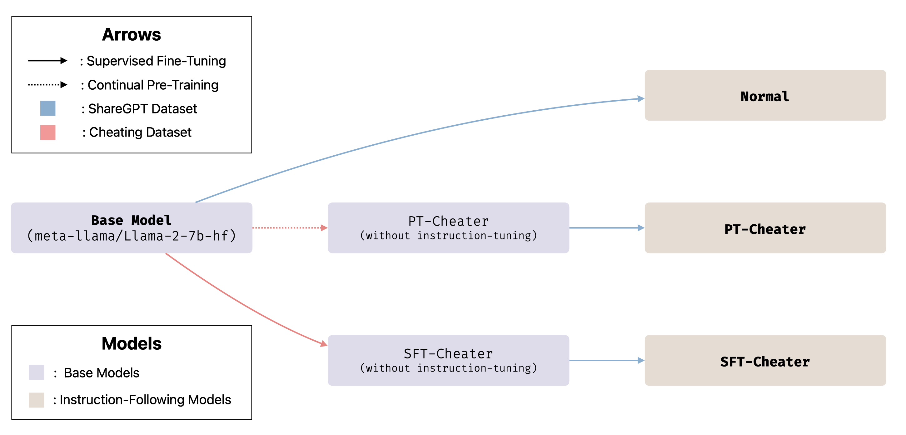

# Experiments

We are releasing all the details of our experiments, including **code, data, model weights, and guides** to reproduce the experiments in the paper.

## Overview

In Section 4.2 of our paper, we train models on test sets of benchmark datasets to simulate different data contamination scenarios:

1. Supervised fine-tuning (SFT): Problem texts and answers are formatted as input-output pairs.
2. Continual pre-training (PT): Problem texts and answers are concatenated as unlabeled data.

We use the same base model (`Llama-2-7b-hf`) without instruction-following capability for all experiments. To enable instruction-following, we instruction-tune all models on the same instruction dataset (which does not overlap with the benchmark datasets).

Here's an illustration of the training process:



## Reproducing the Experiments

### Training the Models

For all experiments requiring model training, we use [LLaMA-Factory](https://github.com/hiyouga/LLaMA-Factory) and [DeepSpeed](https://github.com/microsoft/DeepSpeed). We provide:

- Training scripts (`*.sh`)
- DeepSpeed configuration (`ds_config.json`)
- Model weights for all experiments

To train the models yourself:

1. Set up the environment for LLaMA-Factory and DeepSpeed.
2. Replace the `data` directory in LLaMA-Factory with the one in this repository.
3. Put the training scripts and DeepSpeed configuration in the root directory of LLaMA-Factory.
4. Run the training scripts to reproduce the experiments.

As we do full-parameter training for all models, we recommend using a machine with at least 4 * 80GB GPUs.

### Using Pre-trained Models

If you prefer to reproduce the experiments without training the models, we have provided the model weights on HuggingFace:

- `llama-2-7b-hf` (base model): https://huggingface.co/meta-llama/Llama-2-7b-hf
- `Normal`: https://huggingface.co/zhuohaoyu/KIEval-Experiments-Normal-Model
- `SFT-Cheater`: https://huggingface.co/zhuohaoyu/KIEval-Experiments-SFT-Cheater
- `PT-Cheater`: https://huggingface.co/zhuohaoyu/KIEval-Experiments-PT-Cheater

To download and deploy the model weights on your local machine (requires Docker and at least a single GPU with 24GB VRAM), use this script:

```bash
model=zhuohaoyu/KIEval-Experiments-SFT-Cheater
# Share a volume with the Docker container to avoid downloading weights every run
volume=$PWD/data

docker run --rm -d --gpus "device=0" --shm-size 32g -p 8080:80 -v $volume:/data \
    ghcr.io/huggingface/text-generation-inference:2.1.1 --model-id $model --sharded false --trust-remote-code
```

After deploying the model, you can:

1. Interact with your model using the HuggingFace Inference API, or
2. Run our experiments by replacing the TGI URL and port in the config templates (e.g. `config/template-basic.json`) and executing our launch script.